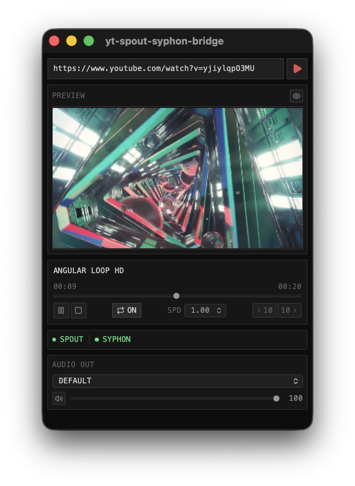

# yt-spout-syphon-bridge

YouTube 動画を **yt-dlp** でストリーミング再生し、映像フレームを **Syphon** (macOS) / **Spout** (Windows) でリアルタイムに外部アプリへ転送するデスクトップアプリ。

TouchDesigner, Resolume, VDMX などの映像ツールと組み合わせて使うことを想定しています。

## 必須の依存関係（事前インストールが必要）

**アプリを使用する前に、以下を Homebrew でインストールしてください。**

```bash
brew install mpv yt-dlp
```

| ツール | 用途 | インストール |
|--------|------|------------|
| `mpv` | 動画デコード・再生エンジン（libmpv を提供） | `brew install mpv` |
| `yt-dlp` | YouTube からのストリーム URL 取得 | `brew install yt-dlp` |

> **注意**: これらのツールがインストールされていないとアプリは起動しますが、動画を再生できません。

Homebrew 自体がインストールされていない場合は [brew.sh](https://brew.sh) の手順に従ってインストールしてください。

## スクリーンショット



## 機能

- YouTube URL を入力するだけで再生開始
- **Syphon** (macOS) / **Spout** (Windows) でフレームをリアルタイム共有
- リアルタイムプレビューウィンドウ
- 再生・一時停止・停止・シーク・ループ・再生速度変更
- オーディオ出力デバイス選択（仮想デバイス対応）
- ミュート・ボリューム調整

## インストール方法（バイナリリリース）

1. [Releases](../../releases) ページから最新の DMG をダウンロード
2. DMG を開き、`yt-spout-syphon-bridge.app` を `/Applications` へドラッグ
3. 初回起動時に「開発元が未確認」と表示された場合:
   - **システム設定 → プライバシーとセキュリティ → このまま開く**

> **Dropbox / クラウドストレージ経由でコピーした場合**
> 拡張属性が付与されて動作が不安定になることがあります。以下で属性を除去してください:
> ```bash
> xattr -cr /Applications/yt-spout-syphon-bridge.app
> ```

## 動作環境

| 項目 | 要件 |
|------|------|
| macOS | 12 Monterey 以降（Apple Silicon / Intel） |
| mpv | `brew install mpv` 必須 |
| yt-dlp | `brew install yt-dlp` 必須 |

## 技術スタック

| レイヤー | 技術 |
|---------|------|
| フレームワーク | Tauri v2 |
| フロントエンド | React + TypeScript + Tailwind CSS |
| ビルドツール | Vite |
| 動画デコード | libmpv2 crate（yt-dlp は mpv が内部で呼び出し） |
| GPU 共有 (mac) | Syphon Framework → Rust FFI (objc2 crate) |
| GPU 共有 (Win) | Spout2 SDK → Rust FFI (bindgen) |
| オーディオ列挙 | CoreAudio FFI（macOS）|

## 開発環境のセットアップ

### macOS

```bash
# 依存ライブラリ
brew install mpv yt-dlp pkg-config

# Node 依存関係
pnpm install

# 開発サーバー起動
pnpm tauri dev

# プロダクションビルド
pnpm tauri build
```

### Syphon.framework の準備

```bash
# Syphon フレームワークを以下に配置
src-tauri/bindings/syphon/Syphon.framework
```

[Syphon Framework](https://github.com/Syphon/Syphon-Framework) から取得してください。

### Windows（未テスト）

1. [libmpv-dev](https://sourceforge.net/projects/mpv-player-windows/files/libmpv/) をダウンロードして PATH を通す
2. [Spout2 SDK](https://github.com/leadedge/Spout2) の `SpoutLibrary.h` と `Spout2.lib` を `src-tauri/bindings/spout2/` に配置
3. `pnpm tauri dev`

## 使い方

1. アプリを起動
2. YouTube URL を入力して Enter または **PLAY** ボタンをクリック
3. 映像が Syphon / Spout で送信開始されるまでしばらく待つ（初回は数秒かかります）
4. 受信側アプリで `yt-spout-syphon-bridge` を選択

## 受信側の設定例

### TouchDesigner

- **Syphon In TOP**（macOS）または **Spout In TOP**（Windows）を追加
- Server Name: `yt-spout-syphon-bridge`

### Resolume / VDMX

- Syphon / Spout 入力ソースから `yt-spout-syphon-bridge` を選択

## トラブルシューティング

### 再生が始まらない / Loading のまま止まる

- `brew install mpv yt-dlp` が完了しているか確認
- yt-dlp を最新版に更新: `brew upgrade yt-dlp`
- インターネット接続を確認

### Syphon / Spout で映像が受信できない

- アプリの再起動を試みる
- 受信側アプリを起動してから、yt-spout-syphon-bridge で再生を開始する

### 「開発元が未確認」でアプリが開けない

- システム設定 → プライバシーとセキュリティ → 「このまま開く」

## ライセンス

MIT
